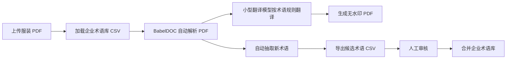
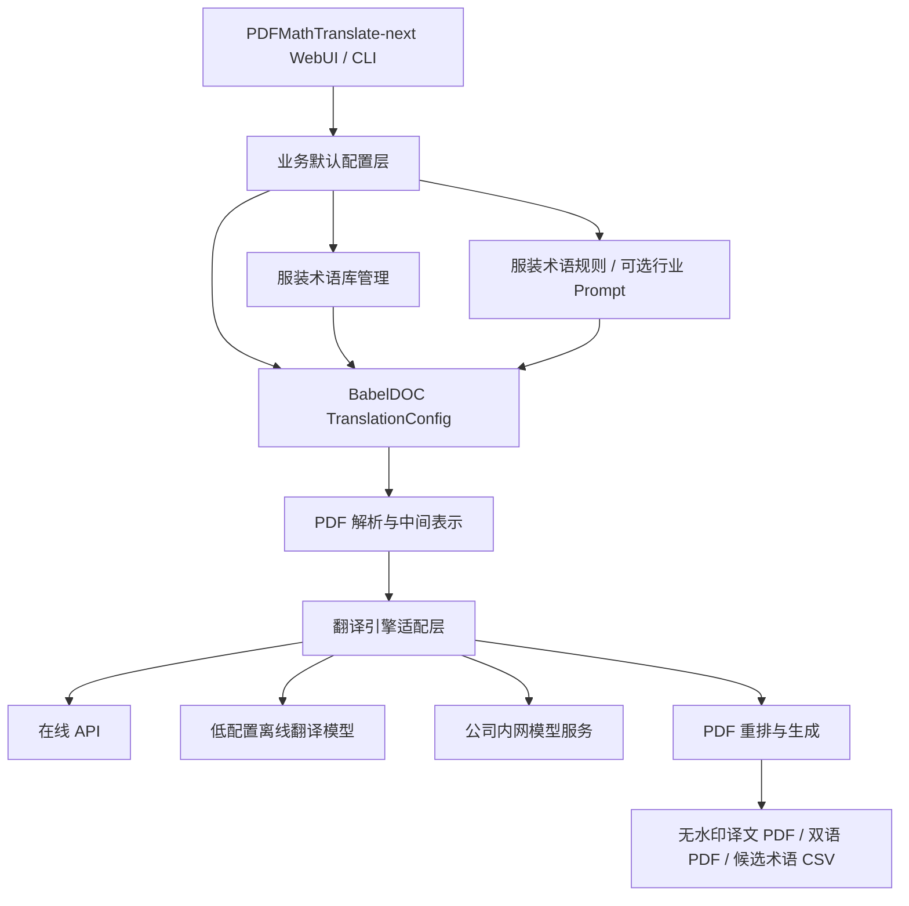

# PDFTranslate 服装类 PDF 翻译软件二开可行性设计规划

> 命名说明（2026-06-07）：
> 当前仓库对外项目名统一使用 `PDFTranslate`。
> 为保持与上游实现兼容，源码目录、Python 包名与 CLI 入口暂仍保留 `PDFMathTranslate-next` / `pdf2zh_next` / `pdf2zh` 等既有命名。
>
> 首发前最终清理状态（2026-06-07）：
> 已移除 `PDFMathTranslate-next/.git`、`BabelDOC/.git`、`PDFMathTranslate-next/dist`、`PDFMathTranslate-next/.verify_env` 等不应进入首发仓库的本地产物；
> 已移除两个子项目内部不再生效的上游 `.github` 配置，并将当前保留的手动发布工作流收口到根目录 `.github/workflows/fashion-release.yml`；
> 当前 `E:\PDFTranslate` 已整理为新的根 Git 工作区，可继续用于后续发布。

日期：2026-06-06  
工作目录：`E:\PDFTranslate`
参考源码：

- `E:\PDFTranslate\PDFMathTranslate-next`
- `E:\PDFTranslate\BabelDOC`

## 1. 背景与目标

你当前验证了 `PDFMathTranslate-next/PDFMathTranslate-next` 对 PDF 文档翻译效果较好，但输出 PDF 首页顶部存在 BabelDOC 水印文字：

> 本文档由 funstory.ai 的开源 PDF 翻译库 BabelDOC v0.6.3 (https://github.com/funstory-ai/BabelDOC) 翻译，本仓库正在积极的建设当中，欢迎 star 和关注。

该文字会遮挡译文版式。目标是在 `PDFMathTranslate-next` 源码基础上做轻量二次开发，形成适合服装行业内部使用的 PDF 翻译工具，重点优化：

- 默认不输出遮挡文档内容的水印；
- 主要面向英文服装资料翻译成中文；
- 优先适配低配置办公电脑，尽量不依赖独立显卡和大模型；
- 面向服装工艺、部位、面料成分、辅料、版型、尺寸规格、洗护、检验等场景使用专业术语；
- 保持 PDFMathTranslate-next 原有的 PDF 解析、排版复原、双语/单语输出、WebUI 和命令行能力；
- 后续可逐步沉淀企业术语库和质量评估流程。

## 2. 两个开源项目的关系

### 2.1 PDFMathTranslate-next 的定位

`PDFMathTranslate-next` 是面向最终用户的 PDF 翻译应用层项目。它提供：

- 命令行入口：`pdf2zh`、`pdf2zh2`、`pdf2zh_next`；
- FastAPI + React/Vite WebUI；
- 多翻译引擎配置；
- 配置文件、环境变量、GUI 参数聚合；
- 对 BabelDOC 的高级封装。

本地源码依据：

- `E:\PDFTranslate\PDFMathTranslate-next\README.md` 写明：该项目基于 BabelDOC，并且是调用 BabelDOC 进行 PDF 翻译的官方参考实现。
- `E:\PDFTranslate\PDFMathTranslate-next\pyproject.toml` 中依赖 `babeldoc>=0.6.3,<0.7.0`。
- `E:\PDFTranslate\PDFMathTranslate-next\pdf2zh_next\high_level.py` 中通过 `create_babeldoc_config()` 把 PDFMathTranslate-next 的设置转换成 BabelDOC 的 `TranslationConfig`。

### 2.2 BabelDOC 的定位

`BabelDOC` 是底层文档/PDF 翻译引擎。它负责：

- PDF 解析；
- 版面、段落、公式、字体、表格等中间表示处理；
- 调用翻译器；
- 根据中间表示重新生成 PDF；
- 水印、术语表、自动术语抽取等核心处理。

本地源码依据：

- `E:\PDFTranslate\BabelDOC\pyproject.toml` 当前版本为 `0.6.3`。
- `E:\PDFTranslate\BabelDOC\babeldoc\format\pdf\translation_config.py` 定义 `WatermarkOutputMode`、`glossaries`、`auto_extract_glossary` 等能力。
- `E:\PDFTranslate\BabelDOC\babeldoc\format\pdf\document_il\midend\typesetting.py` 中 `add_watermark()` 负责插入上述首页水印文字。

### 2.3 关系结论

两者不是互相替代关系，而是“应用层封装 + 底层引擎”的关系：

- `BabelDOC`：核心 PDF 翻译引擎；
- `PDFMathTranslate-next`：用户可直接使用的产品外壳和调用 BabelDOC 的参考实现；
- 二开建议优先改 `PDFMathTranslate-next`，尽量少改 `BabelDOC`，除非需要改变底层排版、解析或水印实现细节。

这样做的好处是升级成本低：后续 BabelDOC 发布新版时，可以继续通过依赖升级获得 PDF 解析和排版能力改进。

## 3. 可行性结论

从现有代码看，本项目非常适合做你要的轻量行业化改造，原因如下：

1. 去水印已有正式配置入口  
   BabelDOC 已支持 `watermark_output_mode = "no_watermark"`，不是必须硬删源码。PDFMathTranslate-next 也已经把该参数暴露到了配置和 GUI。

2. 术语表能力已经存在  
   BabelDOC 支持 glossary CSV，字段为 `source,target`。翻译时只把当前文本命中的术语放入 LLM prompt，适合服装行业术语约束。

3. 自动术语抽取已经存在  
   BabelDOC/PDFMathTranslate-next 支持自动抽取术语并保存 glossary，可用于把新 PDF 中出现的新服装词汇沉淀到企业术语库。

4. 改造范围可控  
   第一阶段可以只改 PDFMathTranslate-next 的默认设置、GUI 文案、预置术语表和系统提示词，不必重写 PDF 解析和渲染。

5. 最大风险在翻译质量治理，不在技术接入  
   PDF 翻译工具本身可行；真正需要长期打磨的是术语库、同义词合并、上下文规则、质检样本和人工审核流程。

6. 当前项目核心仍是 Python 技术栈  
   `PDFMathTranslate-next` 主要使用 Python 开发，新的 WebUI 采用 FastAPI 后端 + React/Vite 前端。它保留 Python/BabelDOC 翻译核心，同时把界面层改成更适合 Docker、多用户和桌面壳的前后端分离结构。

7. WebUI 本身对服务器要求不高  
   如果使用在线 API 翻译，电脑或服务器主要承担 PDF 解析、排版重建、文件读写、少量 OCR/表格处理，真正的大模型推理由在线服务承担。普通办公电脑可以跑，但大文件、扫描件、多用户并发会明显增加 CPU、内存和等待时间。

8. 单机版完全可行，且建议优先做单机版  
   对你们公司内部使用，推荐第一阶段做“每个人电脑上可运行”的单机版：用户在自己电脑上启动程序，浏览器打开本地 WebUI，使用自己的 API Key 或本地模型。这样不需要一开始购置高配服务器，也能降低文件集中上传带来的管理和隐私压力。

9. 不建议一开始改用其他语言重写核心  
   当前 PDF 解析、排版、术语、翻译器适配都在 Python/BabelDOC 生态里。完整改成 Java、C#、Go、Rust 等语言，开发成本和风险会远高于收益。更稳妥的路线是保留 Python 核心，必要时用 Electron、Tauri、.NET、Qt 等做桌面外壳，或者做一个轻量服务器 API。

10. 低配置本地翻译路线可行  
    对“英文服装资料翻译成中文”这个明确目标，优先考虑 Argos Translate、OPUS-MT en-zh 这类翻译专用小模型，而不是 7B/8B 通用 LLM。现有代码也可以通过 CLI translator 或新增 translator 接入这类离线翻译工具，再叠加服装术语 CSV 和术语规则。

### 3.1 当前技术栈判断

当前项目可以理解为：

```text
Python 程序
  -> FastAPI API / React-Vite WebUI / CLI
  -> PDFMathTranslate-next 配置与翻译器适配
  -> BabelDOC PDF 解析、翻译、重排
  -> 在线 API 或本地模型服务
```

这意味着：

- WebUI 是使用浏览器访问的界面，但程序本体仍是 Python；
- 可以部署在服务器上，也可以在每个人电脑上本地运行；
- 命令行、WebUI、未来桌面版可以共用同一个 Python 翻译核心；
- 性能瓶颈通常不在 WebUI，而在 PDF 解析、OCR、表格处理、模型推理和 API 等待。

### 3.2 单机版、服务器版与混合版

推荐优先级：

1. 单机版优先  
   每个用户在自己电脑安装或解压运行。适合初期推广、少量并发、文件不想集中上传的场景。

2. 局域网服务器版作为第二阶段  
   在公司内网部署一台机器，多人通过浏览器访问。适合统一管理术语库、统一模型/API Key、统一日志和任务历史。

3. 混合版作为长期形态  
   普通文件走单机或本地模型，批量任务或高质量任务走服务器/在线 API。不同部门可以根据文件敏感度和速度要求选择翻译模式。

### 3.3 硬件配置粗略评估

使用在线 API 时，服务器要求主要取决于并发用户数和 PDF 复杂度：

| 使用方式 | 典型配置建议 | 说明 |
| --- | --- | --- |
| 单人单机 + 在线 API | 4 核 CPU、8GB 内存、无需 GPU | 普通文本型 PDF 基本可用，模型推理由云端承担 |
| 单人单机 + Argos/OPUS-MT 小模型 | 4 核 CPU、8GB 内存、无需 GPU | 推荐默认低配置路线，适合英文到中文服装资料初版验证 |
| 单人单机 + 较复杂 PDF/OCR | 4-8 核 CPU、16GB 内存、无需 GPU | 扫描件、复杂表格、批量任务更建议 16GB |
| 单人单机 + NLLB/M2M 中小翻译模型 | 8-16GB 内存，GPU 可选 | 模型更大，CPU 可跑但速度要实测 |
| 单人单机 + 本地 7B/8B 通用 LLM | 16GB 内存起步，推荐 6-8GB 以上显存 | 这是“通用大语言模型”路线，不是服装翻译的最低要求 |
| 单人单机 + 本地 14B 级通用 LLM | 32GB 内存，推荐 12-16GB 以上显存 | 质量可能更稳，硬件压力更大 |
| 内网服务器 + 在线 API | 8-16 核 CPU、32GB 内存 | 支持多人排队或低并发同时处理 |
| 内网服务器 + 本地模型 | 32-64GB 内存，按模型选择 GPU | GPU 是主要成本，适合统一部署较大模型 |

这些是规划估算，最终要用你们真实 PDF 样本压测。扫描件、复杂表格、图文混排、超大 PDF 会明显增加资源消耗。

结论：如果目标主要是英文服装资料翻译成中文，不必一开始按 7B/8B LLM 配电脑。更合理的第一轮测试是：

1. Argos Translate 或 OPUS-MT en-zh 这类小型离线机器翻译模型；
2. 加企业服装术语库；
3. 加术语替换/术语锁定规则；
4. 与在线 API 做同一批样本对比。

低配置默认目标建议定为：

- Windows 普通办公电脑；
- 4 核 CPU；
- 8GB 内存可运行；
- 16GB 内存体验更稳；
- 不要求独立显卡；
- 先支持文本型 PDF，扫描件/OCR 和复杂表格作为增强能力。

### 3.4 是否改用其他语言

不建议第一阶段重写语言，原因：

- BabelDOC 核心是 Python，重写会丢掉现成 PDF 解析和重排能力；
- Python 生态对 PDF、OCR、AI、模型服务接入更成熟；
- 当前性能瓶颈更多来自模型/API/PDF 复杂度，不是 Python 语法本身；
- 全量重写会推迟真正可用的服装翻译版本。

推荐方案：

- 核心保持 Python；
- 单机版可用“内置 Python 运行环境 + 启动器”打包；
- 桌面体验需要更好时，用 Tauri/Electron/.NET 做外壳，调用本地 Python HTTP 服务或 CLI；
- 如需“一体 Tauri 安装包”，优先把现有便携版后端作为 Tauri sidecar 或资源文件随安装包分发，再由桌面壳启动本地 FastAPI 服务；这属于分发层调整，不应改动 BabelDOC 的 PDF 解析、排版和重建核心；
- 服务器版使用同一个 Python 核心，对外提供 WebUI 或 REST API；
- 真正需要性能优化时，优先优化缓存、并发、模型推理服务、PDF 预处理，而不是换语言。

### 3.5 在线 API 的限制

使用在线 API 的限制包括：

- 需要网络；
- 需要 API Key；
- 有 QPS、RPM、TPM、月度额度或费用限制；
- 大 PDF 会产生较多 token 成本；
- 文件文本会发送到第三方模型服务，存在数据合规和保密顾虑；
- 服务商接口、模型、价格、限流策略可能变化；
- 如果 API 不稳定，翻译任务会超时或失败。

应对策略：

- 保留在线 API 作为高质量模式；
- 增加本地模型作为离线/低成本/敏感文件模式；
- 开启翻译缓存；
- 设置并发、重试、超时；
- 对不同模型做质量评分；
- 允许每个用户配置自己的 API Key，也允许公司统一配置服务器 API Key。

### 3.6 本地小模型 + 专业术语路线

本地低配置模型路线是可行的，但要把“专业术语”作为独立能力建设，而不是只依赖模型本身。

推荐架构：

```text
本地翻译服务（Argos / OPUS-MT / NLLB / M2M100 / CLI translator）
  + 企业服装术语库 CSV
  + 术语预替换/占位符保护
  + 译后术语校验
  + 候选术语审核与合并
```

实施建议：

- 第一阶段先用 Argos 或 OPUS-MT 这类小型翻译模型打通离线翻译；
- 再测试 NLLB distilled 600M、M2M100 418M 这类中小翻译模型；
- 最后才测试 7B/8B、14B 通用 LLM；
- 对同一批 PDF 同时测试在线 API 和本地模型；
- 重点比较术语命中率、数字保留、表格稳定性、速度、硬件成本；
- 不建议一开始做模型微调，先用 glossary + prompt + 术语审核流程，成本更低也更可控；
- 如果小型翻译模型质量不足，可采用“翻译专用小模型 + 术语规则”或“本地模型预翻译 + 在线模型复核”或“敏感文件本地、普通文件在线”的混合模式。

## 4. 去除顶部水印的设计

### 4.1 现状

BabelDOC 的水印逻辑位于：

`E:\PDFTranslate\BabelDOC\babeldoc\format\pdf\document_il\midend\typesetting.py`

关键逻辑：

- 仅当 `page.page_number == 0`；
- 且 `translation_config.watermark_output_mode == WatermarkOutputMode.Watermarked`；
- 才调用 `add_watermark(page)`；
- `add_watermark()` 中拼接了“本文档由 funstory.ai...”这段文字。

PDFMathTranslate-next 的默认配置位于：

`E:\PDFTranslate\PDFMathTranslate-next\pdf2zh_next\config\model.py`

当前 `PDFSettings.watermark_output_mode` 默认值为：

```python
default="watermarked"
```

并在：

`E:\PDFTranslate\PDFMathTranslate-next\pdf2zh_next\high_level.py`

映射到 BabelDOC 的：

```python
BabelDOCWatermarkMode.Watermarked
BabelDOCWatermarkMode.NoWatermark
BabelDOCWatermarkMode.Both
```

### 4.2 推荐方案

推荐不直接删除 BabelDOC 的 `add_watermark()`，而是在 PDFMathTranslate-next 层默认使用无水印：

1. 将 `PDFSettings.watermark_output_mode` 默认值从 `watermarked` 改为 `no_watermark`；
2. 将 WebUI 的 `Watermark mode` 默认值改为 `No Watermark`；
3. 命令行仍保留 `--watermark-output-mode watermarked`，方便需要保留开源声明时手动开启；
4. 内部版本配置文件默认写入 `watermark_output_mode = "no_watermark"`；
5. 增加一个回归测试，确认默认 settings 生成的 BabelDOC 配置为 `NoWatermark`。

### 4.3 为什么不建议硬删 BabelDOC 水印代码

- BabelDOC 是外部依赖，硬改后每次升级都要处理冲突；
- 当前已有正式参数，使用参数更稳；
- 如果未来开源合规或发布外部版本需要保留声明，可以通过配置恢复。

### 4.4 临时使用方式

在不改源码的情况下，可先通过命令行测试：

```powershell
pdf2zh_next input.pdf --watermark-output-mode no_watermark
```

或在 WebUI 中选择 `No Watermark`。

如果你希望内部版永远默认无水印，则按 4.2 修改源码。

## 5. 服装专业术语翻译设计

### 5.1 术语目标范围

建议把术语库按业务域拆分，而不是放在一个巨大 CSV 中：

- `garment_parts.csv`：服装部位，如 collar、cuff、placket、armhole、hem、yoke；
- `workmanship.csv`：工艺做法，如 topstitch、lockstitch、bartack、overlock、binding；
- `fabric_composition.csv`：面料成分，如 cotton、polyester、spandex、viscose、linen；
- `accessories.csv`：辅料，如 zipper、button、snap、elastic、drawcord；
- `fit_and_pattern.csv`：版型纸样，如 slim fit、relaxed fit、dart、seam allowance；
- `measurement.csv`：尺寸规格，如 chest width、sleeve length、back length、inseam；
- `washing_care.csv`：洗护说明，如 machine wash cold、do not bleach、tumble dry low；
- `quality_inspection.csv`：质检缺陷，如 skipped stitch、puckering、shade variation、oil stain。

### 5.2 CSV 格式

BabelDOC 支持 glossary CSV，建议统一为 UTF-8 with BOM 或 UTF-8，表头固定：

```csv
source,target
collar,领子
cuff,袖口
placket,门襟
topstitch,明线
lockstitch,平缝
overlock,包缝
bartack,打枣
spandex,氨纶
shell fabric,面料
lining,里布
```

术语管理建议：

- 英文源词统一小写，专有缩写保留大写；
- 一词多译时优先收敛到公司内部标准译法；
- 对“可变译法”增加备注字段可保存在内部主表，但导入 BabelDOC 时导出为 `source,target` 两列；
- 对常见复合词优先收录完整短语，如 `front placket`、`self-fabric binding`，不要只依赖单词级翻译。

### 5.3 翻译提示词设计

PDFMathTranslate-next 已支持 `custom_system_prompt`。建议默认内置一段服装行业提示词：

```text
You are a professional apparel and textile technical translator.
Translate into Simplified Chinese using concise garment-industry terminology.
Strictly follow the provided glossary when terms appear.
Preserve measurements, sizes, fabric composition percentages, care symbols, style numbers, PO numbers, color codes, and table structure.
Do not translate brand names, SKU codes, model numbers, or standard abbreviations unless the glossary explicitly provides a target term.
```

中文意图：

- 使用服装/纺织行业术语；
- 强制遵循 glossary；
- 保留尺寸、百分比、货号、色号、PO、SKU 等；
- 不乱翻品牌、型号、缩写；
- 表格和工艺描述尽量短、准、稳定。

### 5.4 术语命中与自动抽取策略

推荐采用“双层术语”：

1. 企业固定术语库  
   由人工维护，作为最高优先级。翻译时通过 `glossaries` 参数传入。

2. 文档自动抽取术语  
   对每个新 PDF 自动抽取可能的术语，保存为候选 glossary。由人工审核后再合并进企业固定术语库。

流程：



### 5.5 术语优先级规则

建议在产品逻辑中明确：

1. 精确短语优先于单词  
   例如 `seam allowance` 优先于 `seam`。

2. 企业术语库优先于自动抽取术语  
   自动抽取只能补充，不覆盖人工审核术语。

3. 文件级临时术语优先于通用行业术语  
   某些客户或品牌有特殊叫法时，允许本次任务上传临时 glossary。

4. 不确定术语不要自动写回正式库  
   候选术语必须审核。

## 6. 产品功能规划

### 6.1 第一版最小可用版本

第一版目标是“内部单机可稳定使用”，不追求复杂平台化：

- 默认无水印输出；
- WebUI 默认中文界面；
- 默认目标语言为简体中文；
- 提供服装术语规则和可选专业系统提示词；
- 支持上传一个或多个术语 CSV；
- 内置一份基础服装术语库；
- 支持输出单语译文 PDF、双语对照 PDF；
- 支持下载自动抽取术语 CSV；
- 新增低配置离线翻译预设，如 Argos/OPUS-MT；
- 保留在线 API/LLM 作为高质量增强模式；
- 提供 Windows 一键启动脚本或可执行包，尽量减少普通用户安装 Python 的成本。

### 6.2 第二版增强功能

- WebUI 增加“行业术语库”下拉选择；
- 提供术语库编辑页面；
- 支持任务历史记录；
- 翻译结果与术语命中日志导出；
- 对未命中但高频出现的英文短语给出候选术语；
- 支持“客户/品牌专属术语库”；
- 支持批量 PDF 翻译；
- 增加术语冲突检测，例如同一个 source 对应多个 target。
- 增加模型/翻译引擎切换面板，例如“低配置离线翻译”“高质量在线 API”“公司内网模型服务”；
- 支持导入/导出用户配置，方便不同电脑快速配置一致。

### 6.3 第三版质量治理

- 建立服装 PDF 翻译测试集；
- 对关键字段做自动质检，如尺寸、百分比、货号是否被改写；
- 术语一致性检查；
- 表格列数/行数保持检查；
- 人工评分闭环；
- 针对常见文档类型建立模板策略：工艺单、BOM、面料检测报告、尺寸表、洗标说明。
- 建立小型离线翻译模型、在线 API 与本地 LLM 的对比评测表，决定哪些文件适合低配置离线翻译，哪些文件需要在线高质量模型。

### 6.4 部署形态规划

第一阶段建议做“单机版”，但代码结构要为服务器版预留空间：

| 形态 | 适用场景 | 优点 | 注意点 |
| --- | --- | --- | --- |
| 单机版 | 每个员工自己电脑使用 | 不依赖服务器，文件留在本机，推广快 | 每台电脑要配置模型/API Key，术语库同步要设计 |
| 内网服务器版 | 多人统一访问 | 术语库、模型、日志统一管理 | 需要服务器配置、权限、任务队列 |
| 混合版 | 部分本机、部分服务器 | 灵活，适合逐步升级 | 配置和流程要设计清楚 |

推荐第一版单机运行方式：

```text
用户电脑
  -> 启动 PDFMathTranslate 服装版
  -> 浏览器打开 http://127.0.0.1:xxxx
  -> 选择 PDF、术语库、翻译模式
  -> 本机生成 PDF
```

未来服务器版运行方式：

```text
公司内网服务器
  -> 部署同一套 Python 翻译核心
  -> 浏览器访问服务器地址
  -> 统一术语库、统一模型/API、统一任务队列
```

## 7. 技术架构设计

### 7.1 总体架构



关键设计原则：

- UI、业务配置、术语库、翻译引擎适配层分离；
- 不把在线 API 写死，所有翻译服务都通过统一 translator 配置进入；
- 单机版和服务器版共用同一个翻译核心；
- 术语库文件路径、模型地址、API Key 都通过配置管理；
- 低配置离线翻译优先使用 Argos、OPUS-MT 或 CLI translator；Ollama、Xinference、OpenAI-compatible 作为增强路线。

### 7.2 建议新增目录

在 `PDFMathTranslate-next` 内新增：

```text
pdf2zh_next/
  domain/
    __init__.py
    apparel.py                 # 服装行业默认配置
  glossaries/
    apparel_base.csv           # 基础术语
    apparel_parts.csv          # 部位
    apparel_workmanship.csv    # 工艺
    apparel_fabric.csv         # 面料成分
  prompts/
    apparel_system_prompt.txt  # 默认行业提示词
  deployment/
    desktop.py                 # 单机运行默认配置
    server.py                  # 服务器运行默认配置
  model_profiles/
    online_high_quality.toml   # 在线高质量模式
    local_argos.toml           # 低配置 Argos 离线翻译模式
    local_opus_mt.toml         # OPUS-MT 英中翻译模式
    local_ollama.toml          # 可选本地 LLM 模式
    lan_openai_compatible.toml # 内网 OpenAI-compatible 模式
```

### 7.3 配置项设计

建议增加业务配置：

```toml
[domain]
profile = "apparel"
default_glossaries = [
  "pdf2zh_next/glossaries/apparel_base.csv",
  "pdf2zh_next/glossaries/apparel_parts.csv",
  "pdf2zh_next/glossaries/apparel_workmanship.csv",
  "pdf2zh_next/glossaries/apparel_fabric.csv"
]
use_domain_system_prompt = true
watermark_output_mode = "no_watermark"
```

建议增加部署和模型配置：

```toml
[deployment]
mode = "desktop"  # desktop, server
host = "127.0.0.1"
port = 7860

[translation_profile]
mode = "local_argos"  # local_argos, local_opus_mt, online_api, local_llm, lan_openai_compatible

[local_model]
provider = "argos"
model = "translate-en_zh"

[online_api]
provider = "openai_compatible"
base_url = ""
model = ""
api_key = ""
```

也可以先不新增 `[domain]`，第一阶段直接修改默认值和 GUI 文案，减少改动。

### 7.4 WebUI 调整

建议调整：

- `Watermark mode` 默认 `No Watermark`；
- 增加“行业模板”选择，默认 `服装/纺织`；
- 增加“翻译模式”选择：低配置离线翻译、在线 API、本地 LLM、公司内网模型；
- `Glossary File` 改成“术语表文件（CSV）”；
- `Custom System Prompt` 仅在 LLM/在线 API 模式下显示，默认填入服装行业 prompt；
- `save automatically extracted glossary` 中文改为“保存自动抽取术语表”；
- 增加提示：CSV 表头必须为 `source,target`。
- 面向 Windows 便携包和 Docker 分发时，普通用户首页默认只显示上传 PDF、翻译、任务状态、下载流程；
- Docker 容器模式默认启用 `require_gui_login`：普通用户账号只进入翻译首页，管理员账号才显示设置入口；后端也必须拒绝普通用户访问设置、客户术语模板和输出历史清理接口；
- 默认账号密码必须支持通过 `PDF2ZH_USER_USERNAME`、`PDF2ZH_USER_PASSWORD`、`PDF2ZH_ADMIN_USERNAME`、`PDF2ZH_ADMIN_PASSWORD` 或 `distribution.toml` 覆盖；
- `distribution.toml` 继续配置 `max_concurrent_jobs`、`max_queue_size`、`qps`、`pool_max_workers` 等局域网部署保护项。

注意：不要在页面上堆太多说明文字。术语 CSV 格式说明可以放到帮助文档或上传失败时提示。

### 7.5 GUI 架构演进建议

当前最终 GUI 架构建议一次性收敛为 FastAPI 后端 + React/Vite 前端 + Tauri 桌面壳。FastAPI 和 React/Vite 不是二选一：FastAPI 负责 API、任务、权限和配置，React/Vite 负责浏览器界面，Tauri 负责 Windows/macOS/Linux 桌面分发，Docker 直接服务同一套 FastAPI + 前端构建产物。

1. 后端服务层
   将翻译任务、配置读取、术语库管理、账号角色、输出历史、任务队列封装到 Python/FastAPI 服务中，继续调用现有 `high_level.py` 和 BabelDOC，不改 BabelDOC 内部。

2. 独立前端
   使用 React/Vite 做 Web 前端，实现上传、任务列表、进度、下载、管理员设置、客户术语模板维护、输出历史清理和角色权限。Docker、浏览器和 Tauri 桌面端复用同一套构建产物。

3. 桌面跨平台壳
   使用 Tauri 包一层本地 Web 前端，启动或连接本地 Python/FastAPI 服务。当前 Tauri 桌面包会通过 `PDFTRANSLATE_BACKEND_BIN` 或系统 `PATH` 中的 `pdf2zh` 启动后端，因此是“桌面壳 + 外部/已安装后端”的形态，还不是内置 Python 后端的一体包。这样核心翻译逻辑不重写，桌面端体验和多平台分发比 Gradio 更可控。

   如果未来需要“一个 Tauri 安装包全带齐”，建议复用 Windows 便携版后端，把嵌入式 Python、`pdf2zh_next`、依赖、BabelDOC 资源、配置模板和启动脚本作为 Tauri sidecar/resource 打包。Tauri 只负责定位资源、启动本地 FastAPI 服务和打开前端，不直接嵌入或重写 BabelDOC 逻辑。

4. GitHub 分发
   GitHub Actions 同时构建 Windows 便携包、Tauri 桌面壳包和 Docker 镜像；Docker 镜像默认启用普通用户/管理员登录，管理员才能进入设置页。当前对普通用户真正“免安装 Python/后端”的离线桌面分发仍以 Windows 便携包为准；Tauri 若要作为同等自包含分发物，需要增加后端 sidecar 打包步骤。

5. BabelDOC 同步升级影响
   一体 Tauri 安装包不应影响 BabelDOC 的同步升级边界。只要 BabelDOC 仍作为 Python 依赖或源码 checkout 被打进后端运行环境，升级时依旧通过 `build_fashion_portable.ps1` / Docker 构建脚本选择本地稳定 `..\BabelDOC`、上游最新源码或指定 ref。需要维护的是打包脚本和资源路径，不是 BabelDOC 核心代码 fork。

当前决策是不再保留 Gradio 兼容入口，避免维护两套 GUI 造成长期升级负担。

## 8. 实施阶段计划

### 阶段 0：源码整理与基线验证

目标：确认本地能跑通。

任务：

- 建立你自己的 fork 或私有仓库；
- 使用 `uv` 或 Python venv 安装依赖；
- 跑通命令行翻译；
- 跑通 WebUI；
- 跑通单机启动脚本；
- 准备 3-5 份真实服装 PDF 样本；
- 建立输出样本目录。

验收：

- 能生成单语译文 PDF；
- 能生成双语 PDF；
- 能用 `--watermark-output-mode no_watermark` 输出无水印文件。
- 至少一台普通办公电脑能完成一份样本翻译。

### 阶段 1：默认无水印与内部版默认配置

目标：解决遮挡问题。

任务：

- 修改 `PDFSettings.watermark_output_mode` 默认值为 `no_watermark`；
- 修改 GUI 默认值为 `No Watermark`；
- 修改默认配置文件生成逻辑；
- 更新相关测试；
- 保留手动开启水印的选项。

验收：

- WebUI 默认生成无水印 PDF；
- CLI 不传水印参数时默认无水印；
- 手动选择 `Watermarked` 时仍可生成水印版本；
- 首页顶部不再出现遮挡文字。

### 阶段 2：基础服装术语库与 prompt

目标：让常见服装文件翻译“像行业人员写的”。

任务：

- 建立基础术语 CSV；
- 整理公司已有术语、工艺单、BOM、样衣单中的高频词；
- 增加默认行业系统提示词；
- WebUI 支持默认加载内置术语库；
- 支持用户额外上传客户术语表。
- 增加低配置离线翻译与在线 API 两种翻译模式的配置入口。

验收：

- 关键术语命中率达到 90% 以上；
- 尺寸、百分比、货号、色号不被错误改写；
- 术语翻译前后一致。
- Argos/OPUS-MT 与在线 API 各完成至少 3 份样本测试，形成对比表。

### 阶段 3：低配置离线翻译验证与单机打包

目标：让用户可以在自己电脑上稳定运行。

任务：

- 选择 Argos Translate 或 OPUS-MT en-zh 作为第一批低配置离线翻译方案；
- 测试 8GB 内存普通办公电脑上的速度和质量；
- 制作离线翻译模型安装说明；
- 制作 Windows 一键启动脚本或打包方案；
- 增加配置向导：离线翻译模式、API Key、默认术语库；
- 记录不同电脑配置下的速度和质量。

验收：

- 普通办公电脑可以使用低配置离线翻译模式；
- 在线 API 作为高质量增强模式保留；
- Argos/OPUS-MT 翻译质量达到内部可接受水平，或明确哪些文档需要在线 API 复核；
- 用户不需要手动改源码即可切换翻译模式。

### 阶段 4：术语库维护工具

目标：让业务人员能维护术语。

任务：

- 增加术语 CSV 导入校验；
- 增加重复项/冲突项检测；
- 自动抽取术语保存为候选文件；
- 建立“候选术语审核后合并”的流程。

验收：

- 同一个英文术语不会在正式库中出现多个中文译法；
- 自动抽取的候选术语能被人工审核；
- 审核后的术语能进入下一次翻译。

### 阶段 5：服务器版与批量翻译

目标：在单机版稳定后，平滑升级到内网服务器或批量工作流。

任务：

- 抽离服务器运行配置；
- 增加任务队列；
- 增加账号/权限或内网访问控制；
- 统一术语库管理；
- 批量上传 PDF；
- 任务状态和错误日志；
- 翻译后自动生成质量报告；
- 检查术语命中、数字保留、表格结构、空白页、OCR 异常。

验收：

- 一批 PDF 可无人值守翻译；
- 错误文件可单独重试；
- 输出报告能帮助人工快速复核。
- 单机版配置和服务器版配置可以切换，不需要重写翻译核心。

## 9. 服装术语库建设方法

### 9.1 初始术语来源

- 公司历史工艺单；
- BOM 表；
- 面辅料成分表；
- 尺寸表；
- 洗唛/吊牌文本；
- 客户英文 spec；
- 质检报告；
- 版师、跟单、工艺师人工补充。

### 9.2 术语字段建议

内部主表建议比 BabelDOC CSV 更丰富：

```csv
source,target,category,priority,customer,note,updated_at
front placket,前门襟,garment_parts,100,,常见于衬衫和外套,2026-06-06
bartack,打枣,workmanship,100,,也有人写作 bar tack,2026-06-06
spandex,氨纶,fabric,100,,同 elastane,2026-06-06
```

导入 BabelDOC 时导出为：

```csv
source,target
front placket,前门襟
bartack,打枣
spandex,氨纶
```

### 9.3 第一批建议术语量

- 最小可用：300-500 条；
- 较好可用：1000-2000 条；
- 稳定生产：3000 条以上，并按客户/品牌持续维护。

不建议一开始追求“大而全”。先覆盖你们最常见的 PDF 类型，边用边补。

## 10. 翻译引擎建议

### 10.1 推荐选择

英文服装资料翻译成中文，且要求低配置优先时，建议优先使用翻译专用小模型和术语规则，而不是通用 LLM。

推荐优先级：

- Argos Translate：低配置离线翻译首选验证对象；
- OPUS-MT en-zh：英文到中文专用小模型；
- CLI translator：用于把 Argos、OPUS-MT 或其他轻量翻译工具接入 PDFMathTranslate-next；
- 在线 API：作为高质量增强或疑难段落复核；
- Ollama/Xinference/OpenAI-compatible 本地 LLM：作为后续增强，不作为第一版低配置默认路线。

低配置方案的核心不是让小模型“懂所有服装术语”，而是让小模型负责通用翻译，企业术语库和规则层负责专业准确性。

### 10.2 在线 API 与本地模型对比

| 方案 | 适合场景 | 优点 | 限制 |
| --- | --- | --- | --- |
| 在线 API | 高质量翻译、复杂说明、术语一致性要求高 | 质量通常更好，无需本地 GPU | 有费用、额度、网络、保密和限流问题 |
| 本地小模型 | 敏感文件、离线使用、低成本批量试译 | 文件不出本机，长期成本可控 | 速度和质量依赖电脑配置与模型能力 |
| 内网模型服务 | 公司统一部署、多人共享 | 统一管理模型和术语，电脑要求低 | 需要服务器/GPU/运维 |
| 混合模式 | 日常生产 | 可按文件敏感度和质量要求选择 | 配置和流程更复杂 |

推荐默认策略：

- 普通员工电脑：优先使用 Argos/OPUS-MT 低配置离线翻译；
- 质量要求更高的文件：使用在线 API 复核或直接在线翻译；
- 敏感文件：优先低配置离线翻译或内网私有模型；
- 高难度文件：优先在线高质量模型；
- 批量文件：优先服务器队列或内网模型服务。

### 10.3 翻译专用小模型建议

你提出的“有没有翻译专用的微小模型”是对的。对英文服装资料翻译成中文，不必一开始使用 7B/8B 通用大语言模型。更轻的路线是“机器翻译专用小模型 + 术语规则”。

优先验证顺序：

| 模型/方案 | 大致定位 | 硬件压力 | 适合度 | 注意点 |
| --- | --- | --- | --- | --- |
| Argos Translate | 离线翻译库，基于 OpenNMT，可作为 Python 库/CLI/GUI 使用 | 低，CPU 可跑 | 很适合第一轮单机验证 | 翻译质量要用服装样本实测 |
| Helsinki-NLP OPUS-MT en-zh | 英文到中文专用翻译模型，PyTorch 权重约 312MB | 低到中，CPU 可跑 | 适合轻量离线英中翻译验证 | 对专业术语需要规则增强 |
| NLLB distilled 600M | 多语言翻译模型，约 600M 参数，权重约 2.46GB | 中 | 可作为第二轮对比 | 比 OPUS-MT 大，速度要测 |
| M2M100 418M | 多语言翻译模型，约 418M 参数，权重约 1.94GB | 中 | 可作为第二轮对比 | 对中英服装术语未必优于专用英中模型 |
| 7B/8B 通用 LLM | 通用大语言模型，可吃 prompt | 高 | 适合复杂语境和 prompt 控制 | 不是单机服装翻译的最低路线 |

第一阶段建议：

- 先测试 Argos Translate；
- 再测试 OPUS-MT en-zh；
- 如果质量不足，再测试 NLLB/M2M100；
- 最后才考虑 Ollama 里的 7B/8B 通用 LLM。

这条路线对普通办公电脑友好得多：很多场景下 8GB 内存就可以开始测试，不需要一开始准备 6-8GB 显存。

### 10.4 小翻译模型的术语增强方式

小型机器翻译模型的优势是轻、快、离线；弱点是通常不支持自然语言 prompt，也不一定原生支持 glossary。因此专业术语要通过翻译前后规则来保证。

建议增加一个“术语约束翻译层”：

```text
原文段落
  -> 识别服装术语、尺寸、货号、色号、百分比
  -> 术语预处理/占位符保护
  -> 调用小型翻译模型
  -> 译后术语校验
  -> 必要时强制替换或提示人工复核
```

规则建议：

- 对尺寸、百分比、PO、SKU、色号、款号使用占位符保护，避免被模型改写；
- 对高优先级服装术语可做译前替换，例如把 `bartack` 替换成 `打枣`，让模型保留中文术语；
- 对复合术语优先匹配长词，例如先匹配 `front placket`，再匹配 `placket`；
- 译后检查：如果原文命中了术语但译文没有出现指定译法，则标记为术语风险；
- 对风险句段可交给在线 API 或本地 LLM 复核。

这样做的意义是：小模型负责普通句子翻译，术语库负责行业准确性，质检规则负责发现不稳定输出。

### 10.5 本地 LLM 建议

如果小型翻译模型无法满足质量，再考虑本地 LLM：

- Ollama：部署简单，适合单机；
- Xinference：适合本地或内网统一模型服务；
- OpenAI-compatible 本地服务：如果你们已有 vLLM、LM Studio、llama.cpp server 等，可复用；
- CLI translator：作为兜底，可以调用公司内部已有翻译程序。

模型选择建议按真实样本测试，不在规划阶段固定死。可先比较：

- 7B/8B 级模型：速度和硬件友好，质量可能不稳定；
- 14B 级模型：术语和上下文更好，硬件要求明显提高；
- 更大模型：更适合服务器，不适合普通办公电脑。

本地模型不是替代术语库，而是与术语库配合。专业准确性主要来自：

- 企业术语库；
- 行业 prompt；
- 自动术语抽取；
- 人工审核；
- 质量评估样本。

### 10.6 参数建议

- 温度：低温或默认，避免同词多译；
- QPS：按 API 限额设置；
- 开启缓存：相同句段和术语可复用，节省成本；
- 开启自动术语抽取但不自动合并；
- 对工艺单、BOM、尺寸表等表格文档，保留表格翻译能力但要用样本验证。

## 11. 法务与开源合规提醒

两个项目均为 AGPL-3.0 许可。内部使用通常问题较小，但如果：

- 对外提供 Web 服务；
- 分发可执行程序；
- 给客户部署；
- 做商业化 SaaS；

就需要认真处理 AGPL 的源码开放和版权声明义务。

去掉 PDF 输出里的遮挡水印不等于可以删除开源许可证或作者声明。建议：

- 软件界面“关于”页保留开源项目鸣谢；
- 文档或内部 README 说明基于 PDFMathTranslate-next 和 BabelDOC；
- 保留 LICENSE；
- 若对外分发修改版，按 AGPL 要求提供对应源码。

## 12. 风险与应对

### 12.1 PDF 版式风险

风险：复杂表格、扫描件、图文混排、服装 CAD 图或嵌入字体可能导致排版偏移。  
应对：建立真实样本测试集；对扫描件开启/关闭 OCR workaround 分别测试；保存失败样本。

### 12.2 术语冲突风险

风险：同一英文词在不同客户或品类中译法不同。  
应对：术语库分层，支持客户级术语库覆盖通用术语库。

### 12.3 数字和规格被误译风险

风险：尺寸、克重、成分比例、色号、PO/SKU 被模型改写。  
应对：prompt 明确保留；增加自动质检；对关键字段使用正则检查。

### 12.4 表格翻译风险

风险：BOM、尺寸表、测试报告中表格结构错位。  
应对：单独准备表格样本；翻译前后检查行列数；对超复杂表格提供 Excel/CSV 工作流备选。

### 12.5 模型成本与稳定性风险

风险：大 PDF 翻译成本较高，API 速率限制影响体验。  
应对：开启缓存；限制并发；批量任务队列；可选本地模型用于低敏文档。

### 12.6 本地模型质量风险

风险：小模型可能出现术语不稳定、漏翻、表格理解差、长上下文丢失等问题。  
应对：用真实服装样本做模型评测；术语库强约束；保留在线高质量模型作为备选；对高风险文件增加人工复核。

### 12.7 单机环境差异风险

风险：每个员工电脑硬件、系统、网络、显卡驱动不同，导致安装和速度差异。  
应对：提供在线 API 模式作为低门槛默认；提供标准安装包和启动脚本；本地模型按硬件分档；收集常见问题。

### 12.8 未来服务器切换风险

风险：如果第一版把文件路径、术语库、模型地址写死在单机逻辑里，后续服务器化会返工。  
应对：从第一版开始使用配置文件管理部署模式、模型 profile、术语库路径；翻译核心保持无状态或少状态；任务历史和共享术语库作为第二阶段模块。

## 13. 建议验收标准

### 功能验收

- 默认无水印；
- 支持单语和双语 PDF；
- 支持上传术语 CSV；
- 支持自动抽取术语并下载；
- 支持低配置离线翻译和在线 API 两类配置；
- 单机版可在普通 Windows 电脑启动；
- WebUI 可用，CLI 可用；
- 翻译失败有错误提示和日志。

### 翻译质量验收

- 核心服装术语命中率 >= 90%；
- 数字、尺寸、百分比、单位保留准确率 >= 98%；
- 关键表格结构保持率 >= 95%；
- 同一文档内同词一致率 >= 95%；
- 人工抽样可接受率 >= 90%。

### 工程验收

- 有最小测试集；
- 有配置文档；
- 有术语库维护说明；
- 能一键启动 WebUI；
- 能打包为单机版；
- 保留服务器部署路径，不需要重写翻译核心。

## 14. 后续开发任务清单

优先级 P0：

- 修改默认水印模式为 `no_watermark`；
- 修改 WebUI 默认水印选项；
- 准备基础服装术语 CSV；
- 默认启用服装术语规则，可选启用行业系统提示词；
- 用 3-5 份真实 PDF 做基线测试；
- 明确单机版启动方式；
- 保留低配置离线翻译和在线 API 两种配置。

优先级 P1：

- 增加行业模板选择；
- 增加翻译模式选择：低配置离线翻译、在线 API、内网模型；
- 增加术语 CSV 校验；
- 自动保存候选术语；
- 增加术语冲突检测脚本；
- 编写内部使用说明；
- 测试 Argos Translate 和 OPUS-MT en-zh；
- 制作 Windows 一键启动脚本或安装包。

优先级 P2：

- 批量翻译；
- 任务历史；
- 质量报告；
- 客户/品牌术语库；
- 内部部署和账号权限；
- 内网模型服务；
- 任务队列；
- 单机版/服务器版配置切换。

## 15. 推荐路线

推荐路线是：

1. 以 `PDFMathTranslate-next` 为主仓库做 fork；
2. 通过配置和默认值解决水印，不硬改 BabelDOC；
3. 第一阶段先做“单机版 + 无水印 + 服装术语 CSV + 低配置离线翻译”；
4. 翻译引擎从一开始做成可切换：低配置离线翻译、在线 API、内网模型；
5. 第二阶段验证 Argos/OPUS-MT，并做 Windows 一键启动；
6. 第三阶段再做术语库管理、质量评估和批量任务；
7. 服务器版作为后续部署形态，共用同一个 Python 翻译核心；
8. BabelDOC 只作为依赖升级，除非必须改底层 PDF 生成逻辑。

这条路线开发量小、风险低，也符合当前代码结构。核心判断是：不要一开始重写语言、强行上服务器或默认依赖本地大模型，先把低配置单机版做扎实；同时不要把在线 API 写死，翻译引擎必须从第一版就可切换。

## 16. 参考资料

- Argos Translate：离线翻译库，可作为 Python library、CLI 或 GUI 使用。  
  https://github.com/argosopentech/argos-translate

- Helsinki-NLP OPUS-MT en-zh：英文到中文翻译模型，`pytorch_model.bin` 约 312MB。  
  https://huggingface.co/Helsinki-NLP/opus-mt-en-zh

- NLLB distilled 600M：多语言翻译模型，`pytorch_model.bin` / `model.safetensors` 约 2.46GB。  
  https://huggingface.co/facebook/nllb-200-distilled-600M

- M2M100 418M：多语言翻译模型，`pytorch_model.bin` 约 1.94GB。  
  https://huggingface.co/facebook/m2m100_418M
