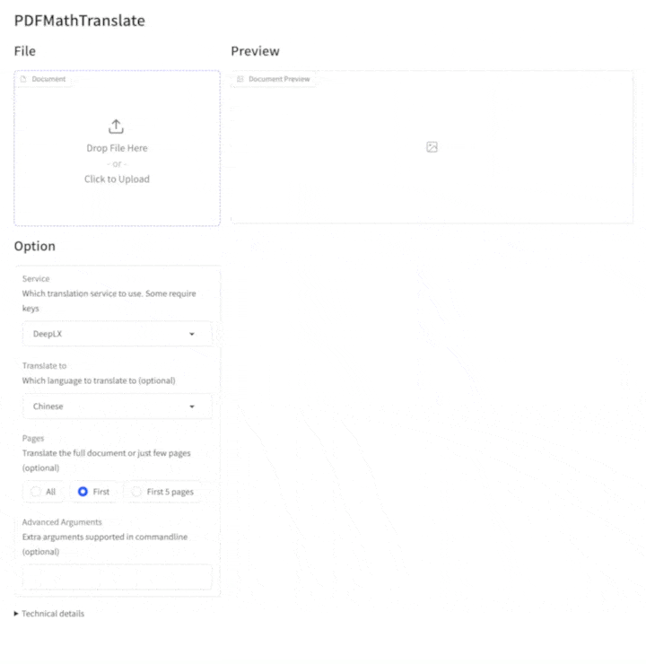

[**Getting Started**](./getting-started.md) > **Installation** > **WebUI** _(current)_

---

### Use PDFMathTranslate via Webui

#### How to open the WebUI page:

There are several methods to open the WebUI interface. If you are using **Windows**, please refer to [this article](./INSTALLATION_winexe.md);

1. Python installed (3.10 <= version <= 3.13); Python 3.13.3 is recommended.

2. Install our package:

3. Start using in browser:

    ```bash
    pdf2zh_next --gui
    ```

4. If your browswer has not been started automatically, goto

    ```bash
    http://localhost:7860/
    ```

    Drop the PDF file into the window and click `Translate`.

By default, the WebUI is regular-user focused and only shows PDF upload, translation, preview, and download. The settings entry is hidden.

Administrators who need to adjust services, branding, glossaries, advanced PDF options, or LAN concurrency limits should prefer editing `distribution.toml` in the config directory:

```toml
[gui_settings]
show_settings_tab = true
settings_admin_password = "change-me"
max_concurrent_jobs = 1
max_queue_size = 8

[translation]
qps = 4
pool_max_workers = 4
```

You can also expose the settings page temporarily at startup:

```bash
pdf2zh_next --gui --show-settings-tab --settings-admin-password "change-me"
```

Or use environment variables: `PDF2ZH_SHOW_SETTINGS_TAB=true` and `PDF2ZH_SETTINGS_ADMIN_PASSWORD=change-me`.

5. If you deploy PDFMathTranslate with docker, and you are using ollama as PDFMathTranslate's backend LLM, you should fill "Ollama host" with

   ```bash
   http://host.docker.internal:11434
   ```

<!--  -->


### Environment Variables

You can set the source and target languages using environment variables:

- `PDF2ZH_LANG_FROM`: Sets the source language. Defaults to "English".
- `PDF2ZH_LANG_TO`: Sets the target language. Defaults to "Simplified Chinese".

## Preview


