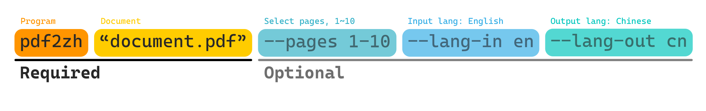
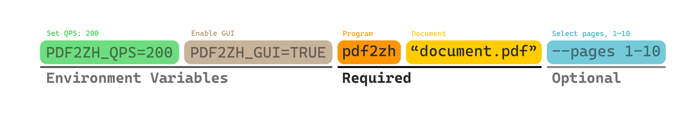

[**高级选项**](./introduction.md) > **高级选项** _(当前)_

---

<h3 id="目录">目录</h3>

- [命令行参数](#命令行参数)
- [限流配置指南](#限流配置指南)
- [部分翻译](#部分翻译)
- [指定源语言和目标语言](#指定源语言和目标语言)
- [使用例外进行翻译](#使用例外进行翻译)
- [自定义提示词](#自定义提示词)
- [自定义配置](#自定义配置)
- [服装翻译增强](#服装翻译增强)
- [跳过清理](#跳过清理)
- [翻译缓存](#翻译缓存)
- [部署为公共服务](#部署为公共服务)
- [认证与欢迎页面](#认证与欢迎页面)
- [术语表支持](#术语表支持)

---

#### 命令行参数

在命令行中执行翻译命令，在当前工作目录下生成翻译文档 `example-mono.pdf` 和双语文档 `example-dual.pdf`。当前默认会回退到无需 API Key 的基础翻译服务，并保留 GUI / CLI 中对其他翻译服务的自定义切换能力。更多支持的翻译服务可见[翻译服务文档](./Documentation-of-Translation-Services.md)。



在下面的表格中，我们列出了所有高级选项以供参考：

##### 参数

| 选项                          | 功能                                                                               | 示例                                                                                                              |
| ------------------------------- | -------------------------------------------------------------------------------------- | -------------------------------------------------------------------------------------------------------------------- |
| `input-files`                   | 要处理的输入 PDF 文件                                                              | `pdf2zh_next example.pdf`                                                                                             |
| `--output`                      | 输出文件的目录                                                              | `pdf2zh_next example.pdf --output /outputpath`                                                                        |
| `--<Services>`                  | 使用 [**特定服务**](./翻译服务文档.md) 进行翻译 | `pdf2zh_next example.pdf --openai`<br>`pdf2zh_next example.pdf --deepseek`                                            |
| `--help`, `-h`                  | 显示帮助信息并退出                                                              | `pdf2zh_next -h`                                                                                                      |
| `--config-file`                 | 配置文件路径                                                          | `pdf2zh_next --config-file /path/to/config/config.toml`                                                               |
| `--report-interval`             | 进度报告间隔（秒）                                                     | `pdf2zh_next example.pdf --report-interval 5`                                                                         |
| `--debug`                       | 使用调试日志级别                                                                 | `pdf2zh_next example.pdf --debug`                                                                                     |
| `--gui`                         | 与 GUI 交互                                                                       | `pdf2zh_next --gui`                                                                                                   |
| `--warmup`                      | 仅下载并验证所需资源后退出                                      | `pdf2zh_next example.pdf --warmup`                                                                                    |
| `--generate-offline-assets`     | 在指定目录中生成离线资源包                              | `pdf2zh_next example.pdf --generate-offline-assets /path`                                                             |
| `--restore-offline-assets`      | 从指定目录恢复离线资源包                             | `pdf2zh_next example.pdf --restore-offline-assets /path`                                                              |
| `--version`                     | 显示版本号后退出                                                                  | `pdf2zh_next --version`                                                                                               |
| `--pages`                       | 部分文档翻译                                                            | `pdf2zh_next example.pdf --pages 1,2,1-,-3,3-5`                                                                       |
| `--lang-in`                     | 源语言代码                                                                              | `pdf2zh_next example.pdf --lang-in en`                                                                                |
| `--lang-out`                    | 目标语言代码                                                                    | `pdf2zh_next example.pdf --lang-out zh-CN`                                                                            |
| `--min-text-length`             | 最小翻译文本长度                                                        | `pdf2zh_next example.pdf --min-text-length 5`                                                                         |
| `--rpc-doclayout`               | 用于文档布局分析的 RPC 服务主机地址                                   | `pdf2zh_next example.pdf --rpc-doclayout http://127.0.0.1:8000`                                                       |
| `--qps`                         | 翻译服务的 QPS 限制                                                       | `pdf2zh_next example.pdf --qps 200`                                                                                   |
| `--ignore-cache`                | 忽略翻译缓存                                                                | `pdf2zh_next example.pdf --ignore-cache`                                                                              |
| `--custom-system-prompt`        | 用于翻译的自定义系统提示词。适用于 Qwen 3 中的 `/no_think`                    | `pdf2zh_next example.pdf --custom-system-prompt "/no_think You are a professional, authentic machine translation engine"` |
| `--glossaries`                  | 术语表文件列表。                                                                     | `pdf2zh_next example.pdf --glossaries "glossary1.csv,glossary2.csv,glossary3.csv"`                                    |
| `--save-auto-extracted-glossary`| 保存自动提取的术语表                                                   | `pdf2zh_next example.pdf --save-auto-extracted-glossary`                                                              |
| `--pool-max-workers`            | 翻译池的最大工作线程数。如果未设置，将使用 qps 作为工作线程数 | `pdf2zh_next example.pdf --pool-max-workers 100`                                                           |
| `--term-qps`                    | 术语提取翻译服务的 QPS 限制。如果未设置，将遵循 qps。         | `pdf2zh_next example.pdf --term-qps 20`                                                                               |
| `--term-pool-max-workers`       | 术语提取翻译池的最大工作线程数。如果未设置或为 0，将遵循 pool_max_workers。 | `pdf2zh_next example.pdf --term-pool-max-workers 40`                                                  |
| `--no-auto-extract-glossary`    | 禁用自动提取术语表                                                           | `pdf2zh_next example.pdf --no-auto-extract-glossary`                                                                  |
| `--primary-font-family`         | 覆盖翻译文本的主要字体族。选项：'serif' 表示衬线字体，'sans-serif' 表示无衬线字体，'script' 表示手写体/斜体字体。如果未指定，则根据原始文本属性使用自动字体选择。 | `pdf2zh_next example.pdf --primary-font-family serif` |
| `--no-dual`                     | 不输出双语 PDF 文件                                                       | `pdf2zh_next example.pdf --no-dual`                                                                                   |
| `--no-mono`                     | 不输出单语种 PDF 文件                                                     | `pdf2zh_next example.pdf --no-mono`                                                                                   |
| `--formular-font-pattern`       | 用于识别公式文本的字体模式                                                   | `pdf2zh_next example.pdf --formular-font-pattern "(MS.*)"`                                                            |
| `--formular-char-pattern`       | 用于识别公式文本的字符模式                                              | `pdf2zh_next example.pdf --formular-char-pattern "(MS.*)"`                                                            |
| `--split-short-lines`           | 强制将短行拆分为不同段落                                       | `pdf2zh_next example.pdf --split-short-lines`                                                                         |
| `--short-line-split-factor`     | 短行分割阈值因子                                                  | `pdf2zh_next example.pdf --short-line-split-factor 1.2`                                                               |
| `--skip-clean`                  | 跳过 PDF 清理步骤                                                                  | `pdf2zh_next example.pdf --skip-clean`                                                                                |
| `--dual-translate-first`        | 在双 PDF 模式下将翻译后的页面放在前面                                             | `pdf2zh_next example.pdf --dual-translate-first`                                                                      |
| `--disable-rich-text-translate` | 禁用富文本翻译                                                           | `pdf2zh_next example.pdf --disable-rich-text-translate`                                                               |
| `--enhance-compatibility`       | 启用所有兼容性增强选项                                            | `pdf2zh_next example.pdf --enhance-compatibility`                                                                     |
| `--use-alternating-pages-dual`  | 使用交替页面模式处理双语 PDF                                                 | `pdf2zh_next example.pdf --use-alternating-pages-dual`                                                                |
| `--watermark-output-mode`       | PDF 文件的水印输出模式                                                     | `pdf2zh_next example.pdf --watermark-output-mode no_watermark`                                                        |
| `--max-pages-per-part`          | 拆分翻译时每部分的最大页数                                            | `pdf2zh_next example.pdf --max-pages-per-part 50`                                                                     |
| `--translate-table-text`        | 翻译表格文本（实验性功能）                                                     | `pdf2zh_next example.pdf --translate-table-text`                                                                      |
| `--skip-scanned-detection`      | 跳过扫描检测                                                                  | `pdf2zh_next example.pdf --skip-scanned-detection`                                                                    |
| `--ocr-workaround`              | 强制将翻译后的文本设为黑色并添加白色背景                              | `pdf2zh_next example.pdf --ocr-workaround`                                                                            |
| `--auto-enable-ocr-workaround`  | 启用自动 OCR 变通方案。如果检测到文档为重度扫描件，将尝试启用 OCR 处理并跳过进一步的扫描检测。详见文档说明。（默认值：False） | `pdf2zh_next example.pdf --auto-enable-ocr-workaround`                     |
| `--only-include-translated-page`| 仅在输出 PDF 中包含已翻译的页面。仅在使用了 --pages 参数时生效。  | `pdf2zh_next example.pdf --pages 1-5 --only-include-translated-page`                                                  |
| `--no-merge-alternating-line-numbers` | 禁用合并带有行号的文档中的交替行号和文本段落 | `pdf2zh_next example.pdf --no-merge-alternating-line-numbers`                                                |
| `--no-remove-non-formula-lines` | 禁用移除段落区域内的非公式行                             | `pdf2zh_next example.pdf --no-remove-non-formula-lines`                                                                |
| `--non-formula-line-iou-threshold` | 设置识别非公式行的 IoU 阈值 (0.0-1.0)                      | `pdf2zh_next example.pdf --non-formula-line-iou-threshold 0.85`                                                       |
| `--figure-table-protection-threshold` | 设置图表保护阈值（0.0-1.0）。图表内的行将不会被处理 | `pdf2zh_next example.pdf --figure-table-protection-threshold 0.95`                                        |
| `--skip-formula-offset-calculation` | 在处理过程中跳过公式偏移量计算          | `pdf2zh_next example.pdf --skip-formula-offset-calculation`                                                           |


##### GUI 参数

| 选项                          | 功能                               | 示例                                         |
| ------------------------------- | -------------------------------------- | ----------------------------------------------- |
| `--share`                       | 启用共享模式                    | `pdf2zh_next --gui --share`                     |
| `--auth-file`                   | 认证文件的路径        | `pdf2zh_next --gui --auth-file /path`           |
| `--welcome-page`                | 欢迎页面的 HTML 文件路径          | `pdf2zh_next --gui --welcome-page /path`        |
| `--enabled-services`            | 启用的翻译服务           | `pdf2zh_next --gui --enabled-services "Bing,OpenAI"` |
| `--disable-gui-sensitive-input` | 禁用 GUI 敏感输入            | `pdf2zh_next --gui --disable-gui-sensitive-input` |
| `--disable-config-auto-save`    | 禁用自动配置保存 | `pdf2zh_next --gui --disable-config-auto-save`  |
| `--server-port`                 | WebUI 端口                             | `pdf2zh_next --gui --server-port 7860`          |
| `--ui-lang`                     | UI 语言                            | `pdf2zh_next --gui --ui-lang zh`                |
| `--brand-name`                  | GUI 顶部品牌名称                     | `pdf2zh_next --gui --brand-name "PDFTranslate"` |
| `--brand-url`                   | GUI 顶部品牌跳转链接                 | `pdf2zh_next --gui --brand-url "https://example.com"` |
| `--require-gui-login`            | 进入 WebUI 前要求账号密码登录；Docker 镜像默认启用 | `pdf2zh_next --gui --require-gui-login --user-password "user-pass" --admin-password "admin-pass"` |
| `--user-username`                | 普通用户登录名；普通用户不能看到设置入口 | `pdf2zh_next --gui --user-username worker` |
| `--user-password`                | 普通用户登录密码 | `pdf2zh_next --gui --user-password "change-me"` |
| `--admin-username`               | 管理员登录名；管理员可看到设置入口 | `pdf2zh_next --gui --admin-username manager` |
| `--admin-password`               | 管理员登录密码 | `pdf2zh_next --gui --admin-password "change-me"` |
| `--max-concurrent-jobs`          | WebUI 同时运行的翻译任务数；局域网低配服务器建议保持 `1` | `pdf2zh_next --gui --max-concurrent-jobs 1` |
| `--max-queue-size`               | WebUI 等待队列最大任务数；超过后会拒绝新请求 | `pdf2zh_next --gui --max-queue-size 8` |

[⬆️ 返回顶部](#toc)

---

#### 服装翻译增强

当前二开版本针对服装资料做了默认增强，尽量保持 `BabelDOC` 的原有版面解析、表格处理和 PDF 重建能力不变，只在外层增加行业术语、提示词和便携化配置。

默认行为：

- 默认输出为 `no_watermark`，即不再生成带顶部遮挡水印的 PDF。
- 对支持的翻译引擎，默认启用内置服装术语表；对支持 LLM 的翻译引擎，同时默认启用服装翻译提示词。
- 内置术语不再只是单个 CSV，而是按“部位 / 测量 / 面料 / 工艺 / 质检 / 洗护 / BOM / tech pack / 包装 / 测试 / 生产跟单 / 印绣花 / 版型纸样”拆分成分类词包，便于持续维护。
- 当前内置 EN->ZH 服装术语总量已扩充到 3700+ 条，覆盖常见 tech pack、BOM、服装部件细分、尺寸/POM、洗水单、包装资料、生产跟单、印绣花、版型纸样、面料性能、交期流程和合规测试高频词。
- 复杂表格相关的 `translate_table_text` 仍保持启用，尽量保留现有表格/结构质量。

GUI 与 CLI 行为：

- `pdf2zh_next --gui` 默认启动 FastAPI 后端和 React/Vite 前端；旧 Gradio 运行路径已移除。
- 普通用户默认只看到上传 PDF、翻译状态和下载首页；管理员可在 React 设置页调整核心运行设置、客户术语模板和输出历史清理。
- 内置服装术语表与客户术语模板会继续自动叠加到支持的服务上。

命令行示例配置：

- `examples/fashion-online-high-quality.toml`
- `examples/fashion-customer-glossary-template.csv`

```bash
pdf2zh_next --config-file examples/fashion-online-high-quality.toml example.pdf
```

说明：

- `fashion-online-high-quality.toml` 中的 API Key 需要替换成你自己的。
- `fashion-online-high-quality.toml` 会默认挂上同目录下的 `fashion-customer-glossary-template.csv`，你可以直接编辑这份 CSV 来补客户 / 品牌 / 成分术语。
- 对不支持术语锁定的普通非 LLM 引擎，内置服装术语表仍会自动停用；对支持 LLM 的服务会继续自动启用。
- 你仍然可以继续通过 `--glossaries` 上传自己的企业术语表，与内置服装术语一起使用。
- 推荐先看 [服装术语来源与扩展建议](./FASHION_GLOSSARY_SOURCES.md)，再按企业客户或品牌补充自己的术语模板。
- GUI 默认品牌名为 `PDFTranslate`，管理员可在设置页或配置文件中通过 `brand_name` / `brand_url` 自定义。
- 如需生成 Windows 绿色便携目录，可执行 `script/build_fashion_portable.ps1`。它默认优先使用本地同级 `..\BabelDOC` 稳定源码，可继续固定在 `v0.6.3`；如需直接使用上游最新源码，可加 `-BabelDOCSource github-latest`，如需指定某个分支 / 标签 / 提交，可加 `-BabelDOCSource github-ref -BabelDOCGitRef <ref>`。
- 如需生成 Docker 容器，可执行 `script/build_fashion_docker.ps1`，容器构建也支持同样的 BabelDOC 选源方式。
- 如需在 GitHub 上自动发布 Windows 便携包、Windows 一体 Tauri 安装包、macOS/Linux Tauri 壳包和 GHCR Docker 镜像，可使用仓库根目录的 `.github/workflows/fashion-release.yml` 手动触发工作流。
- Windows Tauri 后端资源来自同一个便携包构建脚本，因此会包含嵌入式 Python、`pdf2zh_next`、依赖、BabelDOC 离线资源和配置模板。这不会要求修改 BabelDOC 内部逻辑；升级 BabelDOC 时仍通过打包脚本选择本地稳定源码、上游最新源码或指定 ref。
- Docker、便携包和 Tauri 使用同一套 React 登录页和设置页。是否显示居中的登录框由 `require_gui_login` 或认证文件决定；Docker 默认启用登录。

[⬆️ 返回顶部](#toc)

---

#### 限流配置指南

在使用翻译服务时，适当的限流配置对于避免 API 错误和优化性能至关重要。本指南解释了如何根据不同的上游服务限制来配置 `--qps` 和 `--pool-max-worker` 参数。

> [!TIP]
>
> 建议 `pool_size` 不要超过 1000。如果通过以下方法计算出的 `pool_size` 超过 1000，请使用 1000。

##### RPM（每分钟请求数）速率限制

当上游服务有 RPM 限制时，使用以下计算方法：

**计算公式：**
- `qps = floor(rpm / 60)`
- `pool_size = qps * 10`

> [!NOTE]
> 系数 10 是一个经验系数，在大多数场景下通常表现良好。

**示例：**
如果您的翻译服务有 600 RPM 的限制：
- `qps = floor(600 / 60) = 10`
- `pool_size = 10 * 10 = 100`

```bash
pdf2zh example.pdf --qps 10 --pool-max-worker 100
```

##### 并发连接限制

当上游服务有并发连接限制时（如 GLM 官方服务），使用此方法：

**计算公式：**
- `pool_size = max(floor(0.9 * official_concurrent_limit), official_concurrent_limit - 20)`
- `qps = pool_size`

**示例：**
如果您的翻译服务允许 50 个并发连接：
- `pool_size = max(floor(0.9 * 50), 50 - 20) = max(45, 30) = 45`
- `qps = 45`

```bash
pdf2zh example.pdf --qps 45 --pool-max-worker 45
```

##### 最佳实践

> [!TIP]
> - 始终从保守值开始，如有需要再逐步增加
> - 监控您服务的响应时间和错误率
> - 不同的服务可能需要不同的优化策略
> - 在设置这些参数时，请考虑您的具体使用场景和文档大小


[⬆️ 返回顶部](#toc)

---

#### 部分翻译

使用 `--pages` 参数来翻译文档的一部分。

- 如果页码是连续的，你可以这样写：

```bash
pdf2zh_next example.pdf --pages 1-3
```

```bash
pdf2zh_next example.pdf --pages 25-
```

> [!TIP]
> `25-` 包括第 25 页之后的所有页面。如果您的文档有 100 页，这相当于 `25-100`。
> 
> 类似地，`-25` 包括第 25 页之前的所有页面，这相当于 `1-25`。

- 如果页面不连续，你可以使用逗号 `,` 来分隔它们。

例如，如果您想要翻译第一页和第三页，可以使用以下命令：

```bash
pdf2zh_next example.pdf --pages "1,3"
```

- 如果页面同时包含连续和非连续范围，你也可以用逗号连接它们，像这样：

```bash
pdf2zh_next example.pdf --pages "1,3,10-20,25-"
```

此命令将翻译第一页、第三页、第 10 到 20 页，以及从第 25 页开始的所有后续页面。

[⬆️ 回到顶部](#目录)

---

#### 指定源语言和目标语言

参见 [Google Languages Codes](https://developers.google.com/admin-sdk/directory/v1/languages)、[DeepL Languages Codes](https://developers.deepl.com/docs/resources/supported-languages)

```bash
pdf2zh_next example.pdf --lang-in en -lang-out ja
```

[⬆️ 返回顶部](#toc)

---

#### 使用例外进行翻译

使用正则表达式指定需要保留的公式字体和字符：

```bash
pdf2zh_next example.pdf --formular-font-pattern "(CM[^RT].*|MS.*|.*Ital)" --formular-char-pattern "(\(|\||\)|\+|=|\d|[\u0080-\ufaff])"
```

默认保留 `Latex`、`Mono`、`Code`、`Italic`、`Symbol` 和 `Math` 字体：

```bash
pdf2zh_next example.pdf --formular-font-pattern "(CM[^R]|MS.M|XY|MT|BL|RM|EU|LA|RS|LINE|LCIRCLE|TeX-|rsfs|txsy|wasy|stmary|.*Mono|.*Code|.*Ital|.*Sym|.*Math)"
```

[⬆️ 返回顶部](#toc)

---

#### 自定义提示词

<!-- 说明：system prompt 支持情况曾随上游版本变化，请以当前仓库实际行为为准并同步更新此处。 -->

自定义翻译系统提示词。主要用于在提示词中添加 Qwen 3 的 '/no_think' 指令。

```bash
pdf2zh_next example.pdf --custom-system-prompt "/no_think You are a professional and reliable machine translation engine responsible for translating the input text into zh_CN.When translating, strictly follow the instructions below to ensure translation quality and preserve all formatting, tags, and placeholders:"
```

[⬆️ 返回顶部](#toc)

---

#### 自定义配置

有多种方式可以修改和导入配置文件。

> [!NOTE]
> **配置文件层级**
>
> 当使用不同方法修改同一参数时，软件将按照以下优先级顺序应用更改。
>
> 较高优先级的修改将覆盖较低优先级的修改。
>
> **cli/gui > env > 分发配置文件 > 用户配置文件 > 默认配置文件**

面向 Windows 便携版和 Docker 分发时，推荐优先修改配置目录中的 `distribution.toml`。它是管理员用的轻量配置覆盖层，适合放置登录账号、局域网并发/队列、QPS 和 worker 限制等策略；GUI 自动保存的 `config.v3.toml` 不会覆盖它。

- 通过 **命令行参数** 修改配置

对于大多数情况，您可以直接通过命令行参数传递所需的设置。更多信息请参考 [命令行参数](#命令行参数)。

例如，如果您想要启用 GUI 窗口，可以使用以下命令：

```bash
pdf2zh_next --gui
```

- 通过 **环境变量** 修改配置

您可以将命令行参数中的 `--` 替换为 `PDF2ZH_`，使用 `=` 连接参数，并将 `-` 替换为 `_` 作为环境变量。

例如，如果您想要启用 GUI 窗口，可以使用以下命令：

```bash
PDF2ZH_GUI=TRUE pdf2zh_next
```



- 用户指定的**配置文件**

您可以使用以下命令行参数指定配置文件：

```bash
pdf2zh_next --config-file '/path/config.toml'
```

如果您不确定配置文件的格式，请参考下面描述的默认配置文件。

- **默认配置文件**

默认配置文件位于 `~/.config/pdf2zh`。  
请勿修改 `default` 目录中的配置文件。  
强烈建议参考此配置文件的内容，并使用**自定义配置**来实现您自己的配置文件。

> [!TIP]
> - 默认情况下，pdf2zh 2.0 每次在 GUI 中点击翻译按钮时，会自动将当前配置保存到 `~/.config/pdf2zh/config.v3.toml`。此配置文件将在下次启动时默认加载。
> - `default` 目录中的配置文件由程序自动生成。您可以复制它们进行修改，但请不要直接修改它们。
> - 配置文件中可能包含 "v2"、"v3" 等版本号。这些是**配置文件版本号**，**并非** pdf2zh 本身的版本号。


[⬆️ 返回顶部](#toc)

---

#### 跳过清理

当此参数设置为 True 时，将跳过 PDF 清理步骤，这可以提高兼容性并避免一些字体处理问题。

使用方法：

```bash
pdf2zh_next example.pdf --skip-clean
```

或者使用环境变量：

```bash
PDF2ZH_SKIP_CLEAN=TRUE pdf2zh_next example.pdf
```

> [!TIP]
> 当启用 `--enhance-compatibility` 时，跳过清理会自动启用。

---

#### 翻译缓存

PDFMathTranslate 会缓存已翻译的文本，以提高速度并避免对相同内容进行不必要的 API 调用。您可以使用 `--ignore-cache` 选项来忽略翻译缓存并强制重新翻译。

```bash
pdf2zh_next example.pdf --ignore-cache
```

[⬆️ 返回顶部](#toc)

---

#### 部署为公共服务

当在公共服务上部署 pdf2zh GUI 时，您应按照以下说明修改配置文件。

> [!WARNING]
>
> 本项目尚未经过专业的安全审计，可能存在安全漏洞。请在公共网络部署前评估风险并采取必要的安全措施。


> [!TIP]
> - 公开部署时，应同时启用 `disable_gui_sensitive_input` 和 `disable_config_auto_save`。
> - 使用*英文逗号* <kbd>,</kbd> 分隔不同的可用服务。

一个可用的配置如下：

```toml title="config.toml"
[basic]
gui = true

[gui_settings]
enabled_services = "Bing,OpenAI"
disable_gui_sensitive_input = true
disable_config_auto_save = true
```

[⬆️ 返回顶部](#toc)

---

#### 认证与欢迎页面

当使用认证与欢迎页面来指定哪些用户可以使用 Web UI 并自定义登录页面时：

示例 auth.txt
每行包含两个元素，用户名和密码，用逗号分隔。

```
admin,123456
user1,password1
user2,abc123
guest,guest123
test,test123
```

example welcome.html

```html
<!DOCTYPE html>
<html>
<head>
    <title>Simple HTML</title>
</head>
<body>
    <h1>Hello, World!</h1>
    <p>Welcome to my simple HTML page.</p>
</body>
</html>
```

> [!NOTE]
> 只有当认证文件不为空时，欢迎页面才会生效。
> 如果认证文件为空，则不会有认证。 :)

一个可用的配置如下：

```toml title="config.toml"
[basic]
gui = true

[gui_settings]
auth_file = "/path/to/auth/file"
welcome_page = "/path/to/welcome/html/file"
```

[⬆️ 返回顶部](#toc)

---

#### 术语表支持

PDFMathTranslate 支持术语表功能。术语表文件应为 `csv` 格式。
文件中包含三列。以下是一个示例术语表文件：

| source | target  | tgt_lng |
|--------|---------|---------|
| AutoML | 自动 ML  | zh-CN   |
| a,a    | a       | zh-CN   |
| "      | "       | zh-CN   |


对于 CLI 用户：
您可以使用多个文件作为术语表。不同文件之间应使用 `,` 分隔。

```bash
pdf2zh_next example.pdf --glossaries "glossary1.csv,glossary2.csv,glossary3.csv"
```

对于 WebUI 用户：

您现在可以上传自己的术语表文件了。上传文件后，您可以通过点击文件名来查看它们，内容会显示在下方。

[⬆️ 回到顶部](#目录)

<div align="right"> 
<h6><small>本页面的部分内容由 GPT 翻译，可能包含错误。</small></h6>
