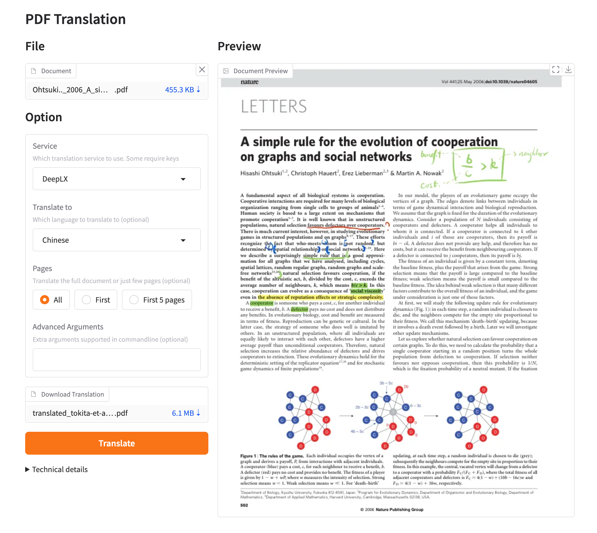
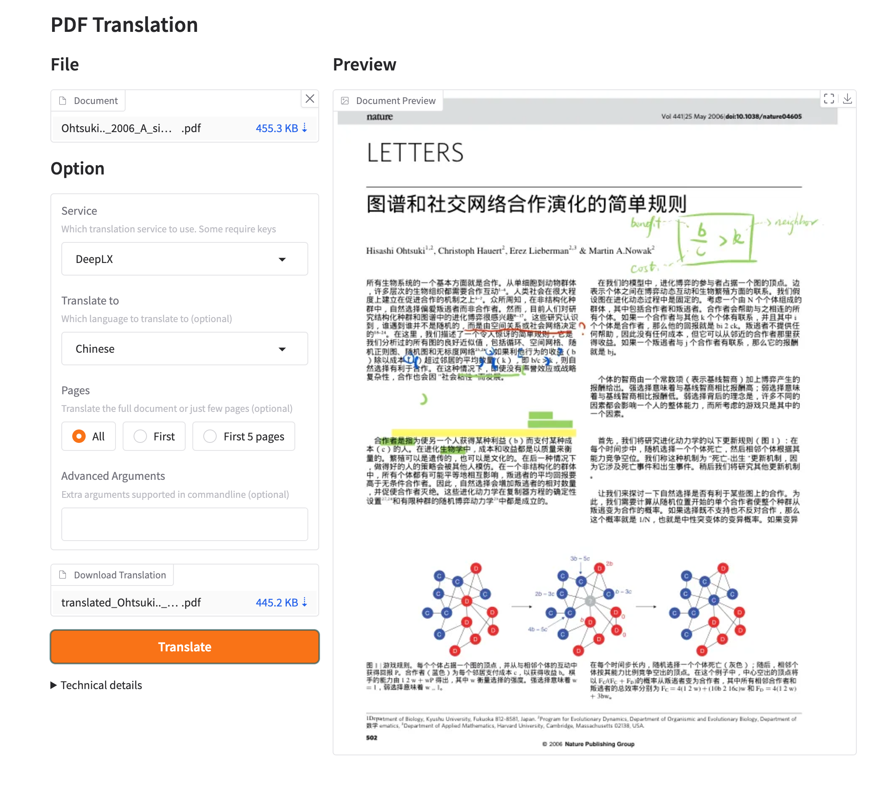

[**开始使用**](./getting-started.md) > **如何安装** > **WebUI** _(当前)_

---

### 通过 Webui 使用 PDFMathTranslate

#### 如何打开 WebUI 页面：

有多种方法可以打开 WebUI 界面。如果您使用的是 **Windows**，请参考 [这篇文章](./INSTALLATION_winexe.md)；

1. 已安装 Python（3.10 <= 版本 <= 3.13），推荐使用 Python 3.13.3

2. 安装我们的软件包：

3. 在浏览器中开始使用：

    ```bash
    pdf2zh_next --gui
    ```

4. 如果浏览器未自动启动，请访问

    ```bash
    http://localhost:7860/
    ```

    选择 `PDF` 文件并点击开始翻译。

默认 WebUI 使用 `Python/FastAPI 后端 + React/Vite 前端`。它复用现有 PDFMathTranslate-next / BabelDOC 翻译核心，不改 BabelDOC 底层，方便后续继续同步上游。Tauri 桌面端和 Docker 容器版使用同一套前端构建产物。

可选 Tauri 桌面壳会通过 `PDFTRANSLATE_BACKEND_BIN` 或系统 `PATH` 中的 `pdf2zh` 启动本地 FastAPI 后端。当前 Tauri 桌面包还不是内置 Python 后端的一体包；需要完整离线 Windows 分发时，仍优先使用 Windows 便携包。

如果后续需要“一个 Tauri 安装包全带齐”，建议把同一套 Python/FastAPI 后端作为 Tauri sidecar 或资源文件打进安装包，再由桌面壳启动它。这只改变分发层，不需要修改 BabelDOC 的 PDF 解析、排版和重建逻辑；只要继续保留便携包脚本里的 BabelDOC 选源方式，本地稳定版本、上游最新源码或指定提交仍然可以正常同步升级。

默认界面面向普通用户，首页只保留上传 PDF、翻译、任务状态和下载流程。Docker 登录为管理员后会显示设置入口；本地不启用账号登录时默认按单机管理员使用。

管理员如需调整服务、品牌、术语表、高级 PDF 参数或局域网并发限制，推荐修改配置目录中的 `distribution.toml`，例如：

```toml
[gui_settings]
require_gui_login = true
user_username = "user"
user_password = "change-user-password"
admin_username = "admin"
admin_password = "change-admin-password"
max_concurrent_jobs = 1
max_queue_size = 8

[translation]
qps = 4
pool_max_workers = 4
```

也可以在启动时临时加入：

```bash
pdf2zh_next --gui --require-gui-login --user-password "user-pass" --admin-password "admin-pass"
```

Docker 镜像默认启用账号登录。普通用户默认 `user` / `pdftranslate`，只能使用翻译首页；管理员默认 `admin` / `admin`，登录后可看到设置入口。部署时建议通过 `PDF2ZH_USER_PASSWORD` 和 `PDF2ZH_ADMIN_PASSWORD` 立即改掉默认密码。

5. 如果您通过 docker 部署 PDFMathTranslate，并使用 ollama 作为 PDFMathTranslate 的后端 `LLM`，则应在 "Ollama host" 中填写

   ```bash
   http://host.docker.internal:11434
   ```

### 环境变量

您可以通过环境变量设置源语言和目标语言：

- `PDF2ZH_LANG_FROM`: 设置源语言。默认为 "English"。
- `PDF2ZH_LANG_TO`: 设置目标语言。默认为 "Simplified Chinese"。

## 预览




<div align="right"> 
<h6><small>本页面的部分内容由 GPT 翻译，可能包含错误。</small></h6>
